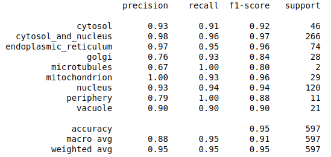
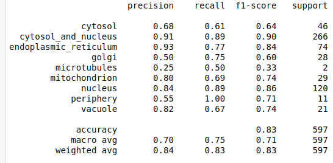

# pombEye : A subcellular localisation classifier for Schizosaccharomyces pombe microscopy images

pombEye is an image classifier that can be used to predict subcellular localisation (eg. GFP/mCherry/mCitrine-tagged proteins) within fission yeast (*S. pombe*, *S. japonicus*, *S. octosporus* and *S. cryophilus* ) species. pombEye runs on an image classifier built using Tensorflow and Python 3 (V2-small uses a Mobilenet V2 base fine tuned with *S. pombe* microscopy images. V2-large uses a Xception base fine tuned with pombe microscopy images). For training and validation, *S. pombe* fluorescent microscope images from the Orfeome project were used (1).

## Prerequisites and installation instruction:

pombEye can be accessed using the python3 source code (.py extension) through Mac/ Linux Terminal.

1. Clone this github repo using the following command

        git clone https://github.com/stevin-wilson/pombEye-Image-Classifier.git

2. Download the trained models from the following links into the folder with github repo clone

    [pombEye V2-large](https://drive.google.com/file/d/1SB6clrB46lsUR5UgjvMTXQmjg4w43Y3k/view?usp=sharing)

    [pombEye V2-small](https://drive.google.com/file/d/1PiJlrQPXWsPGwlY_v17c9KnBjsxXx6wK/view?usp=sharing)

The following packages are needed in order to run pombEye:

### Numpy

    pip install numpy

### OpenCV

    pip install opencv-python

### Tensorflow v2.4.0

    pip install tensorflow 

(For machines with compatible GPU, visit the Tensorflow webpage)

The above-mentioned packages can also be installed using Anaconda.

## Instructions:

1. Open terminal and run the python source code using the following command

        python path_to_the_file/pombEye_V2-small.py

    or

        python path_to_the_file/pombEye_V2-large.py

2. The program loads Tensorflow and compiles the weights file (.h5).

3. The program asks for the path to the input image. The prompt accepts keyboard input. On macOS, drag the input file icon to the terminal and the path is automatically pasted.

It is strongly recommended to use .jpg format for input images instead of .tiff . The program can handle color and grayscale images (Images are converted to 8-bit images prior to feeding into the model).

The top hit for the prediction is listed on top along with a confidence score ranging between 0 and 100.

To exit the program, type 'exit' when the program asks for the path to the input file.

A sample screenshot of the procedure is at this [link](https://github.com/StevinWilson/pombEye-Image-Classifier/blob/master/screenshot_usage_example.png)

## Metrics on Test Data

#### pombEye V2-large

#### pombEye V2-small

## Planned features:

Ability to classify *S. cerevisiae* (budding yeast) microscopy images.

I welcome feedback, suggestions, contributions and input. Please contact me at wilson.3273@osu.edu.

## References:
1.  Matsuyama, A., Arai, R., Yashiroda, Y., Shirai, A., Kamata, A., Sekido, S., … Yoshida, M. (2006). ORFeome cloning and global analysis of protein localization in the fission yeast *Schizosaccharomyces pombe*. Nature Biotechnology, 24(7), 841–847. [https://doi.org/10.1038/nbt1222](https://doi.org/10.1038/nbt1222)
